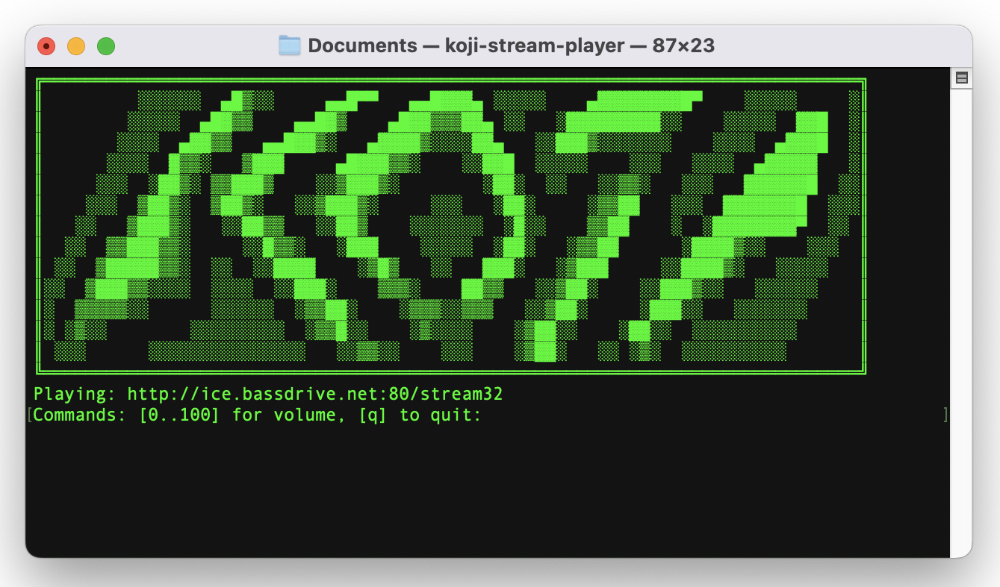
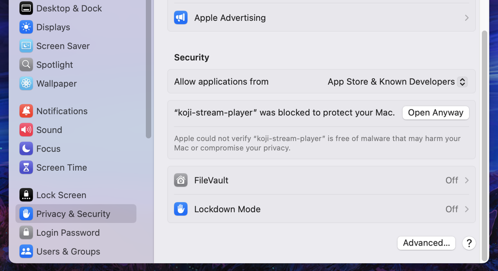

# Koji Stream Player

A simple console-based program to play audio streams for Windows and macOS

## Getting started

Run the executable and provide the URL of the stream you want to play, for example:

`https://ice1.somafm.com/spacestation-128-mp3`

or

`http://ice.bassdrive.net:80/stream32`

That's it!

## Features

- Easy to use
- Volume control
- Console-based

## Additional info for Mac users:

Koji only works on Apple Silicon processors and has been tested on an M1 running 
macOS Sequoia 15.2. Since I don't want to pay the ransom to greedy Apple for the 
"Apple Developer Program", if you want to run it after downloading, you'll 
unfortunately need to manually allow it in "Privacy & Security" 
(your Mac will insist on deleting :)

## Support

If possible, please support the radio station you are listening to! :)

### MEGA IMPORTANT LICENSE INFORMATION (for people who care about this kind of nonsense)

This software uses some fancy third-party stuff like:
"libVLC" and "LibVLCSharp", both under LGPL-something.
Want to know more about their licenses? Go read their sites, it's all there.

These licenses are their thing, not mine.
This software is proudly released under the [Unlicense](LICENSE). You're welcome.
