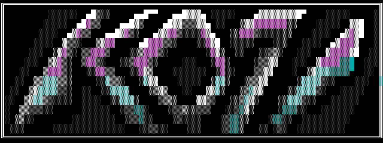
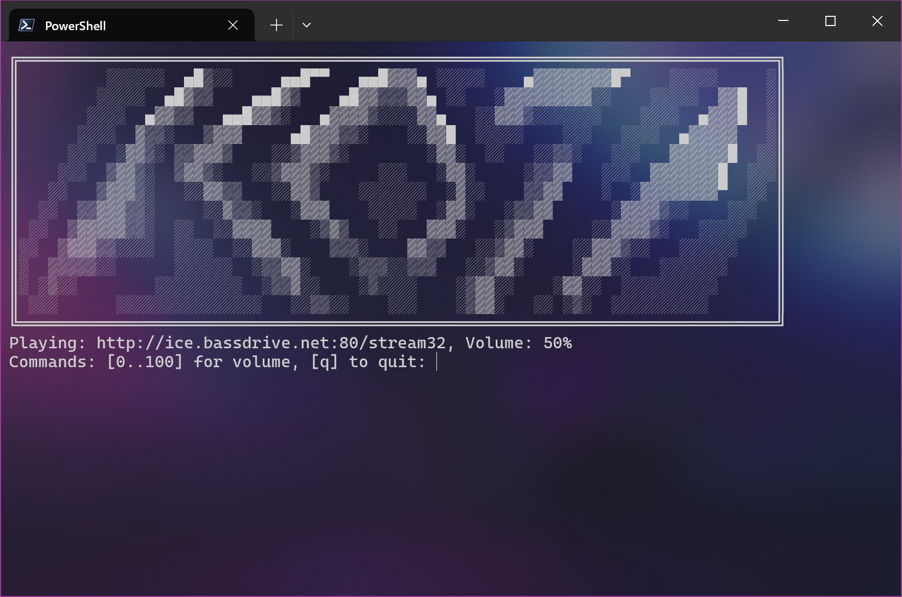

# Koji Stream Player

A simple console-based program to play audio streams.

## Features

- Lightweight and easy to use
- Volume control
- Console-based

## Getting started

Run the executable and provide the URL of the stream you want to play, for example:

`https://ice1.somafm.com/spacestation-128-mp3`

or

`http://ice.bassdrive.net:80/stream32`

That's it!

## Support

If possible, please support the radio station you are listening to! :)

## License

This project is released under the [Unlicense](LICENSE) license.
